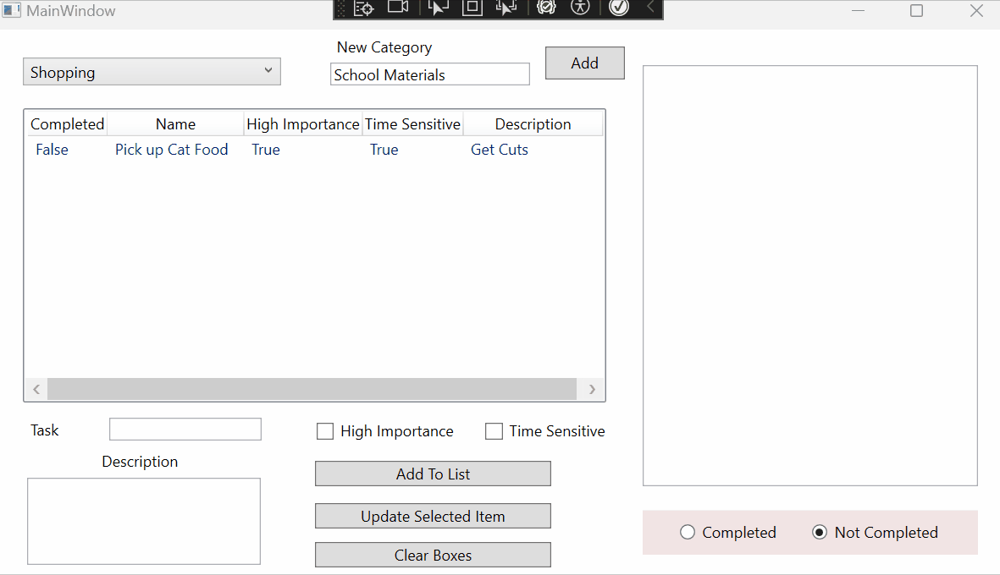
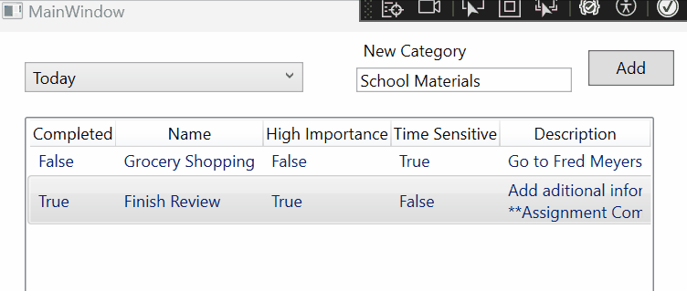

# Prog_2_Final


You will be creating your own application that utilizes all the controls you been learning, and then utilizing lists and creating classes.

You will also get an extra credit opportunity: Create your own classes related to your interest and add the needed functionality to work with.

---


Total Points: 300

| **Task**                                  | **Points** | **Description**                                                                                         |
|-------------------------------------------|------------|----------------------------------------------------------------------------------------------------------|
| ***Section 1: Basic Requirements***         |            |                                                                                                          |
| **Name on Application**                     | 20         | Student must include their name in a clearly visible part of the application.                            |
| **Code Commenting**                         | 30         | Code must be well-commented, explaining the functionality and logic.                                     |
| **Build and Run**                           | 50         | Application must build and run properly without errors upon submission.                                  |
| | | |
| ***Section 2: Using Correct Controls***     |            |                                                                                                          |
| **Display Information**                     |            |                                                                                                          |
|   - ListView                              | 15         | Implement ListView with a Selection Changed Event to display formatted information in RichTextBox.       |
|   - RichTextBox                           | 10         | Correctly implement a RichTextBox to display information.                                                |
| **Choose or Add a Category**                |            |                                                                                                          |
|   - ComboBox                              | 15         | Implement ComboBox with Selected Index Change Event to display category information in ListView.         |
|   - Label, TextBox, Button                | 15         | Correct use of Label, TextBox, and Button for adding a category.                                         |
| **Add Information To Category**             |            |                                                                                                          |
|   - Label: Add Item                       | 5          | Implement a label to indicate the function to add an item.                                               |
|   - TextBox: To Add Item                  | 5          | Use a TextBox for inputting an item to add.                                                              |
|   - Label: Add Description                | 5          | Implement a label to indicate where to add a description.                                                |
|   - RichTextBox: To write a description   | 10         | Use a RichTextBox for writing a detailed description.                                                    |
|   - CheckBox: High Priority               | 5          | Include a CheckBox to mark an item as high priority.                                                     |
|   - CheckBox: Time Sensitive              | 5          | Include a CheckBox to mark an item as time sensitive.                                                    |
|   - Button: To Add Item to Selected Category | 5      | Implement a button to add the item to the selected category.                                             |
| - Update Information                      |            |                                                                                                          |
|   - Button: To update selected item       | 10         | Implement a Button to update selected items.                                                             |
| **Clear Boxes**                             |            |                                                                                                          |
|   - Button: Clears boxes and resets buttons | 10      | Implement a Button that clears text boxes, rich text boxes, check boxes, and resets radio buttons.       |
| **Is Completed**                            |            |                                                                                                          |
|   - Radio Button: Is Completed            | 5          | Implement and correctly function a 'Is Completed' radio button.                                          |
|   - Radio Button: Not Completed           | 5          | Implement and correctly function a 'Not Completed' radio button.                                         |
| | | |
| ***Section 3: Class Construction***         |            |                                                                                                          |
| - Create 2 Classes                        |            |                                                                                                          |
|   **Item.cs**                               |            |                                                                                                          |
|     - Fields (4-5)                        | 20         | Create 4 to 5 fields within the `Item` class, relevant to the application's functionality.               |
|     - Constructor                         | 20         | Implement a constructor in `Item` class to initialize the fields.                                        |
|     - Properties                          | 20         | Create properties for each field in the `Item` class for proper encapsulation.                           |
|     - Method for Formatted String         | 20         | Develop a method in `Item` class that returns a formatted string for display in a RichTextBox.           |
|   **Category.cs**                           |            |                                                                                                          |
|     - Fields                              | 10         | Create a string field for the category name and a List of `Item` objects in the `Category` class.        |
|     - Constructor                         | 15         | Construct the `Category` class with a parameter for the name and instantiate the list within the constructor. |
|     - Properties                          | 15         | Implement properties for the name and the List of `Item` objects in the `Category` class.                |
|     - Method to Add Item                  | 20         | Create a method in `Category` class that allows adding an `Item` to the list.                            |

---


## Knowledge Need

***All Controls***

- Give names to reference in your C# code
- Add events
- Change Text ( replace and append )
- Get values

> ***[Message Box](https://github.com/WCramRTC/GA_1_WillCram)***
> - Message Box

> ***[Guided Assignment 2](https://github.com/WCramRTC/GA_2_WillCram)***
> - TextBox
> - Label
> - Button

> ***[Rich Text Box ( Run specifically )](https://github.com/WCramRTC/GA_Prog_2_RichTextBox)***
>    - Give run a name
>    - How to append text
>    - How to replace text

> ***[ListBox and ComboBox](https://github.com/WCramRTC/GA_Prog_2_ListAndComboBox)***
>    - Items Source
>    - Selected Index
>    - On Selection Change event

> ***[List](https://github.com/WCramRTC/GA_Prog_2_Lists)***
>    - Create and initialize in local and global scope
>    - Add files
>    - Access individual elements

> ***[Classes](https://github.com/WCramRTC/GA_Classes)***
>    - Create classes in their own files
>    - Fields
>    - Constructors
>    - Properties
>    - Methods
>    - Object in objects
>    - How to override to strings
>    - Checking for null

> ***[CheckBox and Radio Buttons](https://github.com/WCramRTC/GA_Prog_2_CheckBoxRadioButton)***
>    - How to get and respond to the selected value

> ***[ListView](https://github.com/WCramRTC/GA_ListView)***
>    - Items Source
>        - Change source on load, and while application is running
>    - Selected Index
>        - Check if item is selected ( index != -1 )
>    - On Selection Change Event

---
## Layout


- Category change box
    - ComboBox to hold category names
        - Has an on selection changed event
        - Displays ToDo items for category in ListView
- Add New Category
    - Label, TextBox, Button
- Display ToDo Items
    - ListView
        - Has a selection changed event
        - Selected item information displays on rich text box to the right and text box info below.
- Task Name
    - Label, TextBox
- Description Box
    - Label
    - Rich Text Box
- High Importance
    - Check Box
- Time Sensitive
    - Check Box
- Complete and Not Completes
    - Radio Buttons, grouped together
- Add To List
    - Button
    - Event that adds new item to current category
- Update Selected Item
    - Button
    - Updates the currently selected item with the new information
- Clear Boxes
    - Clears all check boxes, text boxes, rich text boxes, sets the list view selection to -1, and sets radio button to not completed.
- Display Information
    - Rich Text Box

---

## Classes

### ***Item.cs***
The item class represents a single "To Do" list item.

- **Fields and Properties ( Gets and Sets for all )**

```csharp
    string _name;
    string _description;
    bool _highImportance;
    bool _timeSensitive;
    bool _isCompleted;
```

- **Constructor**
    - Takes arguments for 
        - Name
        - Description
        - High Importance
        - Time Sensitive
    - Sets `_isCompleted` to false

- **Methods**
    - `string DisplayInformation()`
        - Returns a string with the instanced Items information.

        Ex.


    - `void AssignmentCompleted()`
        - Assigns true to the `isCompleted` property
        - Appends "**Task Completed**" to the description

        Ex. 

---

### ***Category.cs***
Category represent a unique category item with it's own list of "To Do" items associated with it.

- **Fields and Properties ( getters and setters for both)**

```csharp
    string _name;
    List<Item> _todoItemsInCategory;
```

- **Constructor**
    - Create a constructor that takes a name
    - Initialize the List<Item> in your constructor

- **Methods**
    - `void AddItemToCategory(Item item)`
        - Pass an item in to add it to our category to do list
        - This replaces have the user have to do use `categoryName.TodoItemsInCategory.Add()`. It helps read ability and *abstracts* how our code works ( more on this in programming 3 ).
    - `override string ToString()`
        - Return the category name
        - This is used to easily display the category name to our combo box.

--- 

## MainWindow.xaml.cs

### Create two global variables

```csharp
    List<Category> _categories;
    Category selectedCategory;
```

- Initialize the list in MainWindow()
- Assign categories to your combo boxes ItemsSource
- Set the selected index of your combo box to 0. The ensures the first item will be selected.

### - **Add Task ( Button Click Event )**
- When clicked, creates a new Item instance and assigns it to the currently selected category
- Validation: Requires name and description. If either are **Empty**, display a MessageBox saying "Please enter name and description".
- Refresh the ListView. `listViewName.Items.Refresh();`


### - **Update Task ( Button Click Event )**

- When clicked, the item selected in the list view is updated with the information located below.
- If the Completed radio button is selected, the selected Items `assignmentCompleted()` method should be called.
- Refresh the ListView. `listViewName.Items.Refresh();`


### - **Clear Input Boxes ( Button Click Event )**

- When clicked, all information is cleared from the boxes.
    - The task TextBox, description, and full display are set to "".
    - The check boxes are set to false
    - The radio button, Not Completed, is selected
    - !! The selected index of the list view is set to -1.
        > Setting the selected index to -1 DeSelects everything from the list view.


### - **Add Category ( Button Click Event )**

- When clicked, adds a new category to our category list.
- The Combo box should refresh to show the next category.
    - `comboBoxName.Items.Refresh();`


### - **Preload**
Call this in your MainWindow(). This will populate your categories list with 3 categories, and 1 item in each category a piece. Feel free to change and add information as you like.

```csharp
    _categories = new List<Category>
    {
        new Category("Today"),
        new Category("Shopping"),
        new Category("Travel")
    };

    // Adding items to our Today category
    int index = 0;
    _categories[index].AddItemToCategory(new Item("Grocery Shopping", "Go to Fred Meyers", false, true));

    // Adding items to our Shopping category
    index = 1;
    _categories[index].AddItemToCategory(new Item("Pick up Cat Food", "Get Cuts", true, true));

    // Adding items to our Travel category
    index = 2;
    _categories[index].AddItemToCategory(new Item("TPick up travel adapter", "Make sure it covers the UK", true, true));
```

### - **Select Item in ListView ( Selection Changed Event )**

- When an item is clicked in the list view, the `DisplayInformation()` method is called and the resultant string is assigned to the RTB Display Information.
- The task TextBox, description RTB, two check boxes and the radio button are all updated with information from the selected item.



### - **Change Category ( Selection Changed Event )**
- When a new category is selected, the items in it's `_todoItemsInCategory` are displayed in the list view.
- This can be done by assigning the categories name to the list view .ItemsSource


